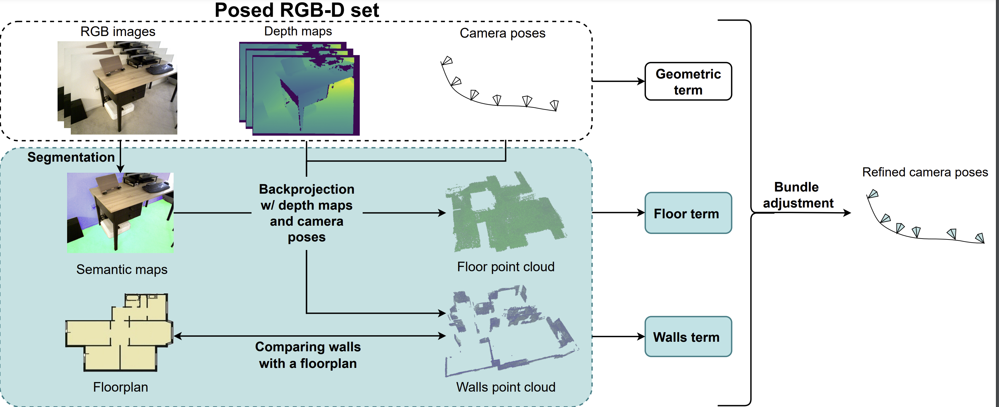

# FACaP

This repository contains an implementation of Floorplan-Aware Camera Poses Refinement paper, which was presented on 
IROS 2022. 

> **Floorplan-Aware Camera Poses Refinement**<br>
> [Anna Sokolova](https://scholar.google.ru/citations?hl=en&user=0Pcv9G4AAAAJ),
> [Filipp Nikitin](https://scholar.google.com/citations?user=DOljaG8AAAAJ&hl=en),
> [Anna Vorontsova](https://github.com/highrut),
> [Anton Konushin](https://scholar.google.com/citations?user=ZT_k-wMAAAAJ)
> <br>
> Samsung Research <br>
> https://arxiv.org/abs/2210.04572

## Introduction


For many indoor scenes, there exists an image of a technical
floorplan that contains information about the geometry and 
main structural elements of the scene, such as walls, 
partitions, and doors. We argue that such a floorplan is 
a useful source of spatial information, which can guide 
a 3D model optimization.

The standard RGB-D 3D reconstruction pipeline consists of
a tracking module applied to an RGB-D sequence and a bundle
adjustment (BA) module that takes the posed RGB-D sequence and
corrects the camera poses to improve consistency. We propose
a novel optimization algorithm expanding conventional BA that
leverages the prior knowledge about the scene structure in
the form of a floorplan. Our experiments on the Redwood
dataset and our self-captured data demonstrate that utilizing
floorplan improves accuracy of 3D reconstructions.




## Installation

We recommend using `Dockerfile` to build a container for the project. 
All required libraries are described in the environment file `env.yaml`. In the final version
we drop all of the `pytorch3d` dependencies, so you do not have to install it. 

## Data structure
All scans should be preprocessed to the next structure:
```
scan
│   floorplan.npy
│   db.h5
│
└───arcore
│   │   cam_params-0001.txt
│   │   ...
│   │   depth-0001.png
│   │   ...
│   │   frame-0001.png
│   │   ...
│   │   pose-0001.txt
│   │   ...
│   │
│
└───segmentation
│   │   frame-0001_wall.png
│   │   ...
│   │   frame-0001_floor.png
│   │   ...
│  

```

Here:
- `floorplan.npy` is an array with the shape `n x 4`. Each element is a segment of the floorplan.
- `db.h5` features a database in COLMAP format, which is used to map covisible points. 
- `cam_params-0001.txt` intrinsics of the corresponding camera (w, h, f1, f1, p1, p2).
- `pose-0001.txt` extrinsic matrix of the corresponding camera
- `depth-0001.png` depth map
- `frame-0001.png` RGB frame
- `frame-0001_wall.png` rotated mask of walls for the corresponding frame
- `frame-0001_floor.png` rotated mask of the floor for the corresponding frame

For more details please see the file `facap/data/scan.py`.

## Usage

To run an experiment you should create a config file run experiment. 

```python
    python scripts/run_experimnt.py --config path_to_config --device "cuda:0"
```

The example of the config can be found in the path `experiments/config.yaml`.

## Citation

### Citation

If you find this work useful for your research, please cite our paper:
```
@INPROCEEDINGS{9981148,
  author={Sokolova, Anna and Nikitin, Filipp and Vorontsova, Anna and Konushin, Anton},
  booktitle={2022 IEEE/RSJ International Conference on Intelligent Robots and Systems (IROS)}, 
  title={Floorplan-Aware Camera Poses Refinement}, 
  year={2022},
  volume={},
  number={},
  pages={4857-4864},
  doi={10.1109/IROS47612.2022.9981148}}
```
